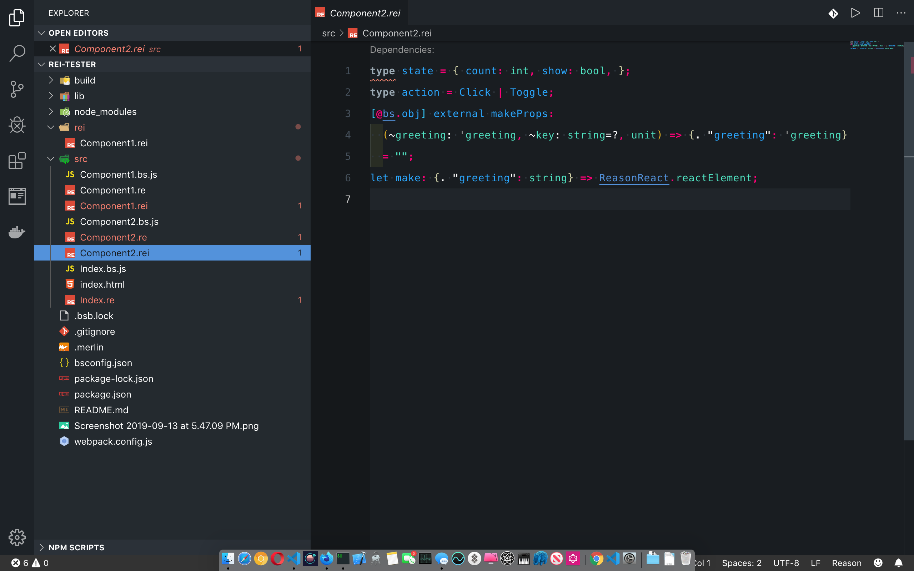
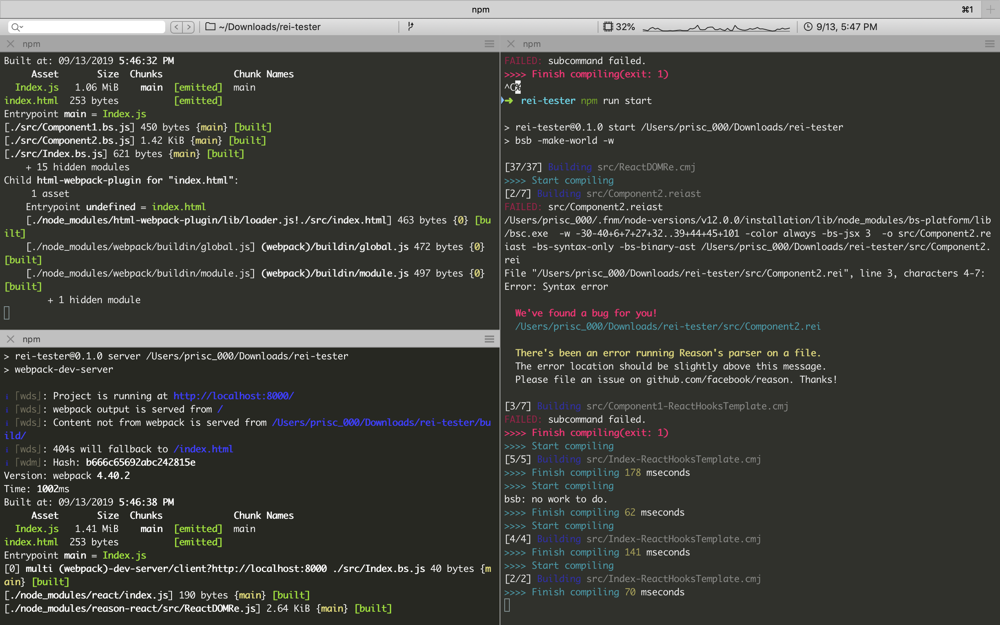

# rei-demo-and-notes

## Trust the compiler, not the editor

Note: globally installed `bs-platform` is 6.0 so that is what got installed in the project.

`.rei` files generated with script at [`./rei.gen.sh`](./rei.gen.sh)

Original script out put for `Component1.re` is in [`rei/`](./rei) with all the others.

```reason
type state = { count: int, show: bool, };
type action = Click | Toggle;
[@bs...] external makeProps:// this throws an error.
  (~greeting: 'greeting, ~key: string=?, unit) => {. "greeting": 'greeting}
  = "";
let make: {. "greeting": string} => ReasonReact.reactElement;
```

Fix the error by changing it to:

```reason
let handleClick: 'a => unit;
[@bs.obj] external makeProps:
  (~message: 'message, ~key: string=?, unit) => {. "message": 'message} = "";
let make: {. "message": string} => ReasonReact.reactElement;
```

At this point in time, `VsCode` shows red, but compiler is green and the project runs.

## editor-screenshot



## terminal-screenshot



## project is start with `bsb -init name -theme react-hooks`

```sh
npm install
npm start
# in another tab
npm run webpack
```

After you see the webpack compilation succeed (the `npm run webpack` step), open up `build/index.html` (**no server needed!**). Then modify whichever `.re` file in `src` and refresh the page to see the changes.

**For more elaborate ReasonReact examples**, please see https://github.com/reasonml-community/reason-react-example

## Run Project with Server

To run with the webpack development server run `npm run server` and view in the browser at http://localhost:8000. Running in this environment provides hot reloading and support for routing; just edit and save the file and the browser will automatically refresh.

Note that any hot reload on a route will fall back to the root (`/`), so `ReasonReact.Router.dangerouslyGetInitialUrl` will likely be needed alongside the `ReasonReact.Router.watchUrl` logic to handle routing correctly on hot reload refreshes or simply opening the app at a URL that is not the root.

To use a port other than 8000 set the `PORT` environment variable (`PORT=8080 npm run server`).

## Build for Production

```sh
npm run clean
npm run build
npm run webpack:production
```

This will replace the development artifact `build/Index.js` for an optimized version as well as copy `src/index.html` into `build/`. You can then deploy the contents of the `build` directory (`index.html` and `Index.js`).

If you make use of routing (via `ReasonReact.Router` or similar logic) ensure that server-side routing handles your routes or that 404's are directed back to `index.html` (which is how the dev server is set up).

**To enable dead code elimination**, change `bsconfig.json`'s `package-specs` `module` from `"commonjs"` to `"es6"`. Then re-run the above 2 commands. This will allow Webpack to remove unused code.
